# CSWin-Transformer 模型自验报告

> 林丽森 finder4alex@163.com


## 1. 模型简介

### 1.1 网络模型结构简介

`CSWin Transformer`是`Swin`原班人马在2021年7月提出的网络结构，网络结构见下图。

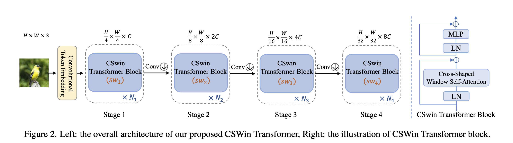

其核心是十字形状的自注意力（`Cross-Shaped Window (CSWin) self-attention`）。它由并行的横向自注意力和纵向的自注意力组成，对于一个多头的自注意力模型，`CSWin Transformer Block`将头的一半分给和横向自注意力，另一半分给纵向自注意力，然后最后将这两个特征拼接起来，如下图所示。将设网络有 `K` 个头，其中 `1,…,K/2 `用于横向自注意力的计算， `K/2+1,…,K `用于纵向自注意力的计算。

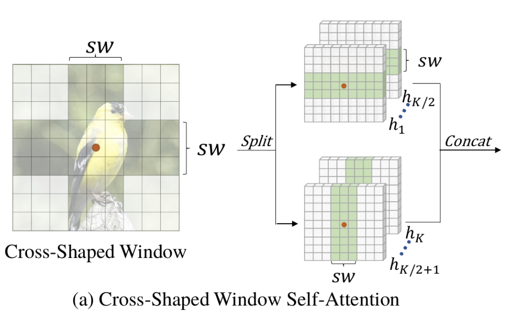

除此之外，作者还引入了一个能够适应不同大小输入特征的相对位置编码（`Locally-enhanced Positional Encoding (LePE)`），用卷积来加强局部偏置，并直接加到SA的结果后面，来减少计算量。如下图所示。

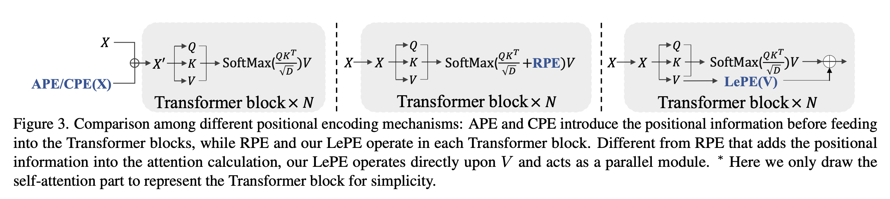


### 1.2 数据集

> 所用数据集地址：https://git.openi.org.cn/kaierlong/imagenet2012_whole/datasets

使用训练及测试数据集如下：

```shell
使用的数据集：ImageNet2012

数据集大小：共1000个类、224*224彩色图像
训练集：共1,281,167张图像
测试集：共50,000张图像
数据格式：JPEG
注：数据在dataset.py中处理。
下载数据集，目录结构如下：
└─dataset
   ├─train                 # 训练数据集
   └─val                   # 评估数据集
```


### 1.3 代码提交地址

暂时提交在启智中，私有未开源。

仓库地址如下：https://git.openi.org.cn/finder4alex/CSWin-Transformer.git


## 2. 代码目录结构说明

代码目录结构及说明如下：

```shell
.
├── README.md				// 说明文档
├── README_CN.md		// 中文说明文档
├── LICENSE
├── image						// 文档图片目录
├── src
│   ├── args.py
│   ├── configs			// 模型参数配置目录
│   │   ├── cswin_144_24322_large_224.yaml
│   │   ├── cswin_64_24322_small_224.yaml
│   │   └── parser.py
│   ├── data				// 数据加载及处理目录
│   │   └── __init__.py
│   │   ├── augment
│   │   │   ├── __init__.py
│   │   │   ├── auto_augment.py
│   │   │   ├── custom_transforms.py
│   │   │   ├── mixup.py
│   │   │   └── random_erasing.py
│   │   ├── data_utils
│   │   │   ├── __init__.py
│   │   │   └── moxing_adapter.py
│   │   ├── imagenet.py
│   ├── models			// 模型定义目录
│   │   └── __init__.py
│   │   ├── cswin
│   │   │   ├── __init__.py
│   │   │   ├── cswin.py		// CSWin-Transformer 网络定义文件
│   │   │   ├── get_cswin.py
│   │   │   └── misc.py
│   ├── tools				// 相关工具目录
│   │   ├── __init__.py
│   │   ├── callback.py
│   │   ├── cell.py
│   │   ├── criterion.py
│   │   ├── get_misc.py
│   │   ├── optimizer.py
│   │   └── schedulers.py
│   └── trainers		// 训练目录
│       ├── __init__.py
│       ├── model_ema.py
│       ├── train_one_step_with_ema.py
│       └── train_one_step_with_scale_and_clip_global_norm.py
├── eval.py						// 评估文件
└── train.py					// 训练文件
└── train_multi.py		// 再训练（finetune）文件，适配启智平台多数据集
```


## 3. 自验结果（交付精度规格时需要补齐）

**特别说明：**

- 本次训练分三阶段完成，故有三个运行环境配置。
- 超参数配置已更新为最终值，实际读者可一次完成训练，环境配置采用1即可。


### 3.1 自验环境

软硬件环境如下：

- 启智AI引擎：MindSpore-1.6.1-python3.7-aarch64
-  Ascend: 8 * Ascend-910(32GB) | ARM: 192 核 2048GB


**详细环境配置参见下图：**

第一阶段环境配置：

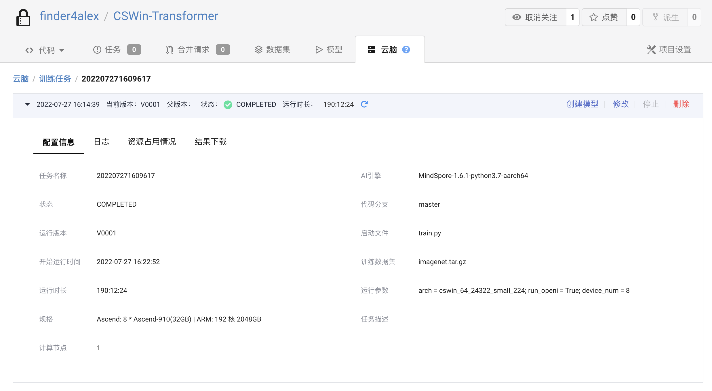

第二阶段环境配置：

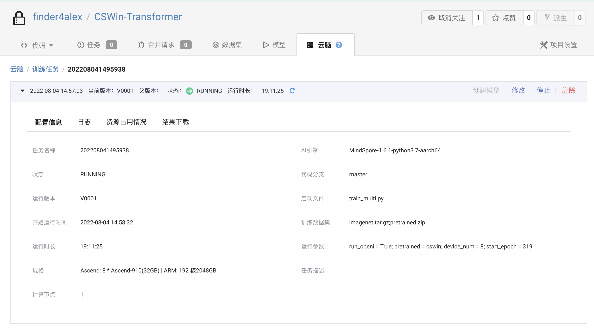

第三阶段环境配置：

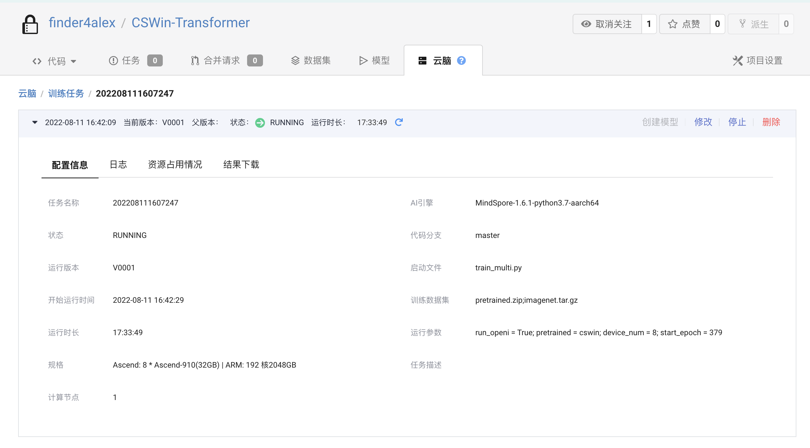

### 3.2 训练超参数

超参数配置如下：

> 其中data_url由启智平台实际数据地址替换，训练时替换。
>
> 特别说明：此训练超参数是支持一次训练达标的最终超参数。

```yaml
# Architecture
arch: cswin_64_24322_small_224

# ===== Dataset ===== #
data_url: ./data/imagenet
set: ImageNet
num_classes: 1000
mix_up: 0.8
cutmix: 1.0
auto_augment: rand-m9-mstd0.5-inc1
interpolation: bicubic
re_prob: 0.25
re_mode: pixel
re_count: 1
mixup_prob: 1.0
switch_prob: 0.5
mixup_mode: batch
crop_ratio: 0.9


# ===== Learning Rate Policy ======== #
optimizer: adamw
lr_scheduler: cosine_lr
base_lr: 0.001
min_lr: 0.00001
warmup_length: 20
warmup_lr: 0.000001
cool_length: 80
cool_lr: 0.00001
tail_length: 60
tail_lr: 0.000001
over_length: 60
over_lr: 0.0000001


# ===== Network training config ===== #
amp_level: O1
keep_bn_fp32: True
beta: [ 0.9, 0.999 ]
is_dynamic_loss_scale: True
use_global_norm: True
clip_global_norm_value: 5.
enable_ema: True
ema_decay: 0.99992
loss_scale: 1024
weight_decay: 0.05
momentum: 0.9
label_smoothing: 0.1
epochs: 380
batch_size: 128


# ===== Hardware setup ===== #
num_parallel_workers: 8
device_target: Ascend

# ===== Model config ===== #
drop_path_rate: 0.4
patch_size: 4
embed_dim: 64
depth: [ 2, 4, 32, 2 ]
split_size: [ 2, 2, 7, 7 ]
num_heads: [ 2, 4, 8, 16]
mlp_ratio: 4.0
```

***三阶段参数说明（只包含区别部分）***

第一阶段参数

```yaml
cool_length: 20
cool_lr: 0.00001
tail_length: 0
tail_lr: 0.000001
over_length: 0
over_lr: 0.0000001
epochs: 320
```

第二阶段参数

```yaml
cool_length: 80
cool_lr: 0.00001
tail_length: 0
tail_lr: 0.000001
over_length: 0
over_lr: 0.0000001
epochs: 380
```

第三阶段参数

```yaml
cool_length: 80
cool_lr: 0.00001
tail_length: 60
tail_lr: 0.000001
over_length: 60
over_lr: 0.0000001
epochs: 500
```


### 3.3 训练

### 3.3.1 如何启动训练脚本

训练如何启动：

- 启智平台

模型训练在启智平台完成，完整训练配置如下图所示：

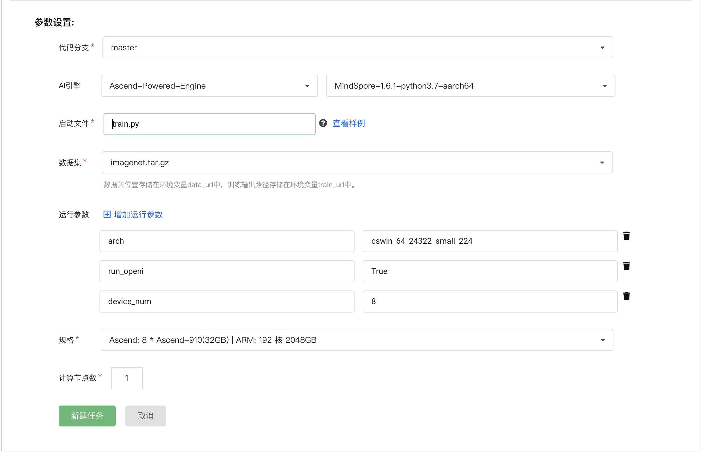

- 本地命令

**如果需要本地训练，可以使用如下命令：**

```shell
python3 train.py --run_openi=True --arch=cswin_64_24322_small_224 --device_num=8
```


#### 3.3.2 训练精度结果

- 论文精度如下:

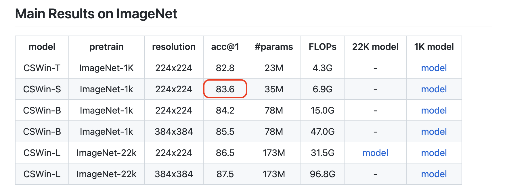

- 复现精度如下：

  - 第一次训练结果

  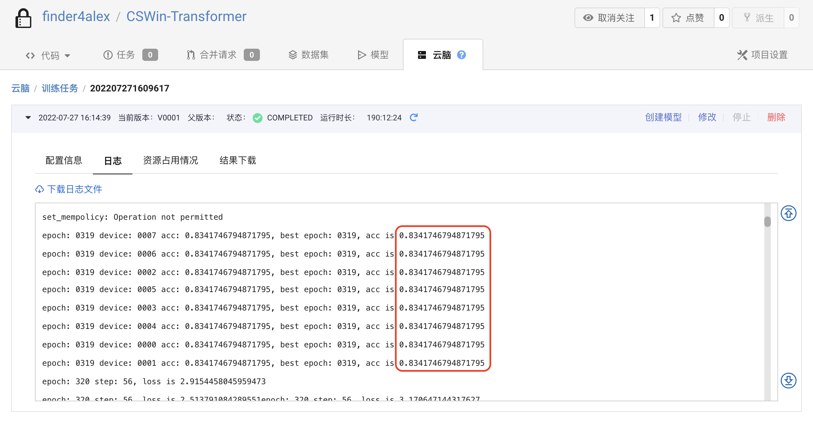

  - 第二次再训练结果

    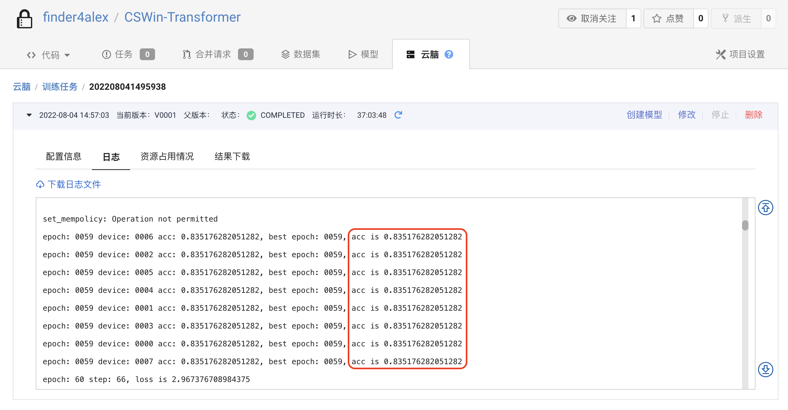

  - 第三次再训练结果

    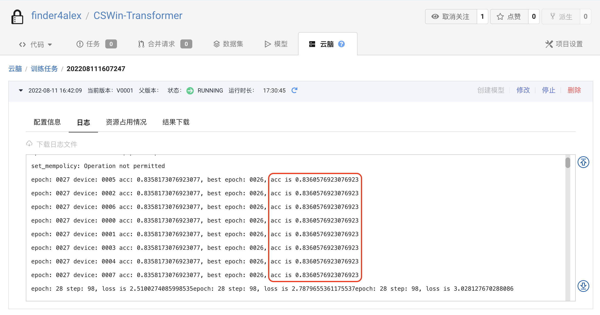

- 精度结果对比

  - 论文精度为：83.6
  - 复现精度为：
    - 83.42（第一阶段最优值）
    - 83.51（第二阶段再训练最优值）
    - 83.60（第三阶段再训练最优值）
    
  - 对比结论：达到论文精度


### 3.4 模型推理

推理命令如下：

```shell
python3 eval.py --config=src/configs/cswin_64_24322_small_224.yaml --pretrained={ckpt_path} --device_id={device_id} --device_target={device_target} --data_url={data_url}
```


## 4. 参考资料

### 4.1 参考论文

- [CSWin Transformer: A General Vision Transformer Backbone with Cross-Shaped Windows](https://arxiv.org/abs/2107.00652)


### 4.2 参考git项目

- [microsoft/CSWin-Transformer](https://github.com/microsoft/CSWin-Transformer)


### 4.3 参考文献

- [CSWin-T：微软、中科大提出十字形注意力的 CSWin Transformer](https://www.cvmart.net/community/detail/5075)
- [Vision Transformer 之 CSWin Transformer](https://zhuanlan.zhihu.com/p/388165447)


